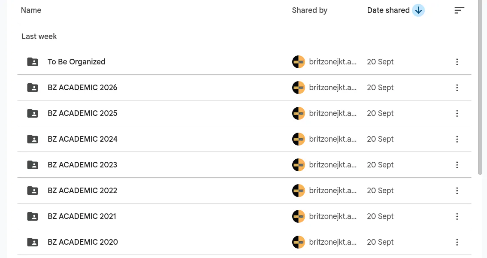
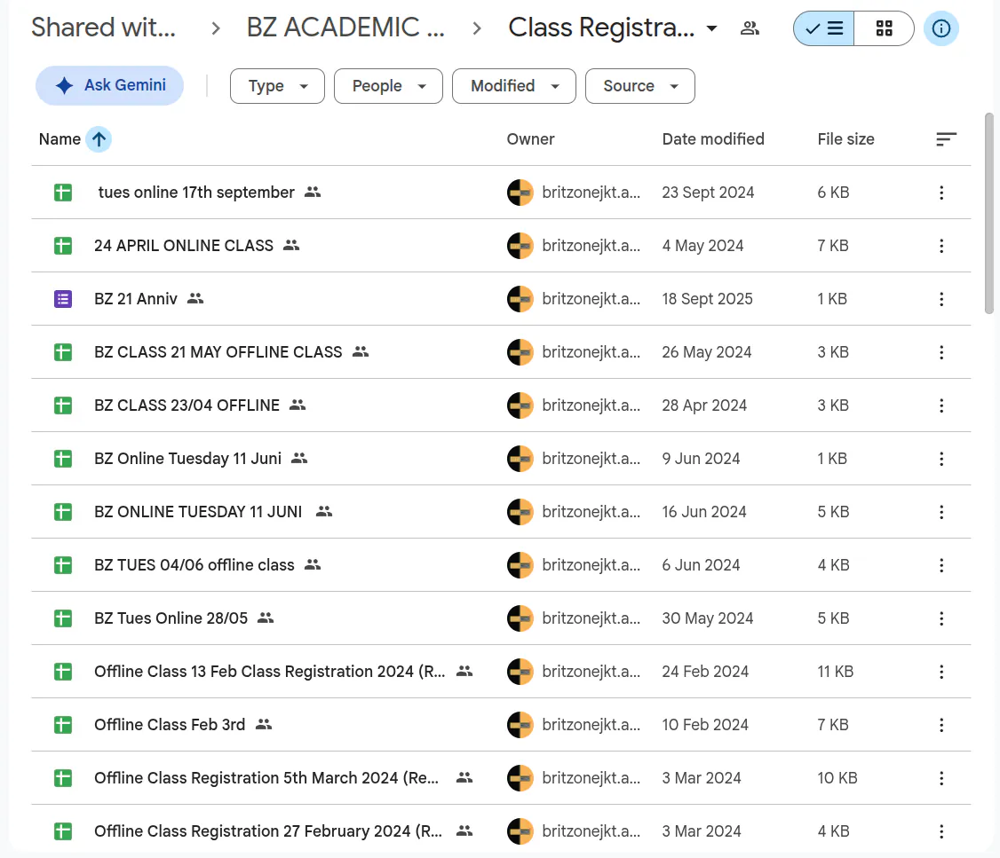
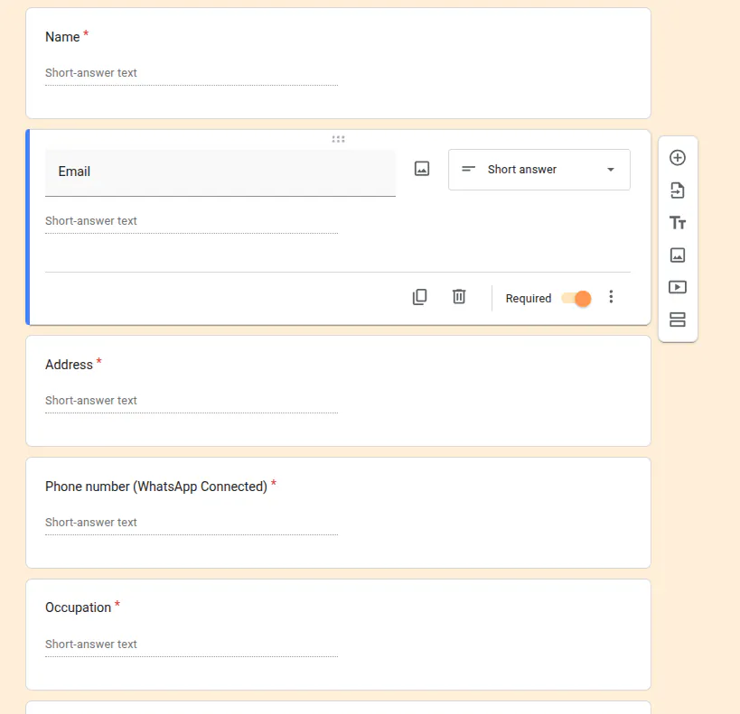

## Business Context

Britzone is one of the largest English Community in indonesia based that has been active since 2003. It conducts 3-5 sessions every week, where participants have to register through Google Forms to attend for every session. Unfortunately, these data are never properly managed, leaving them to pile up over time.

Starting in 2026, efforts have been made to standardize the system, including overhauling the division structure, creating a new IT team, creating standards for class registration, unifying forms, etc.

## My Role

As the leader of the IT team, I volunteered to help clean up the past data that have been piling up in Google Drive. The plan is to cleanly aggregate every session's data into a single, standardized format that can be easily analyzed for various purposes, including demographic analysis. 

## Discovered Issues

### Scattered Files & Inconsistent Naming

The Google Drive is organized by year.



Before 2025, each session is stored in a different sheet, with inconsistent naming convention, making it difficult to merge the data for analysis. 



### No response validation

The Google Sheets come from Google Form's response data. So the next thing to check is the Google Form itself. What I found is, there is no response validation at all. The question is only marked as required, and the participant can enter anything. 



User inputs are one of the main sources of data quality issues. Without proper validation, the data can be inaccurate or incomplete. 

### No reliable field to match participants across sessions

Every participant is required to register for every new session, entering the same data again (name, email, phone number). However, these are all self-report with no verification, the participant can practically fill out anything. 

## Cleaning Plan

The purpose of the project is to cleanly aggregate every session's registration data. Therefore, the first issue is the most relevant. The second is also relevant as we need to put more efforts in the data cleaning process, but not directly crucial to the project. The third is more of analysis concern. 

First, I'll download every year's registration folder. Then, I'll load them up into R

Since 2025 and 2026 is already in a better shape, I'll focus on merging 2020-2024 data. 

```
448.8 MiB  britzone-class-registration
    0   B ├─  EDA.qmd
448.8 MiB └─  registration-sheets
446.6 MiB    ├─  2021
868.0 KiB    ├─  2023
840.0 KiB    ├─  2022
584.0 KiB    └─  2024

7 directories, 1167 files

```