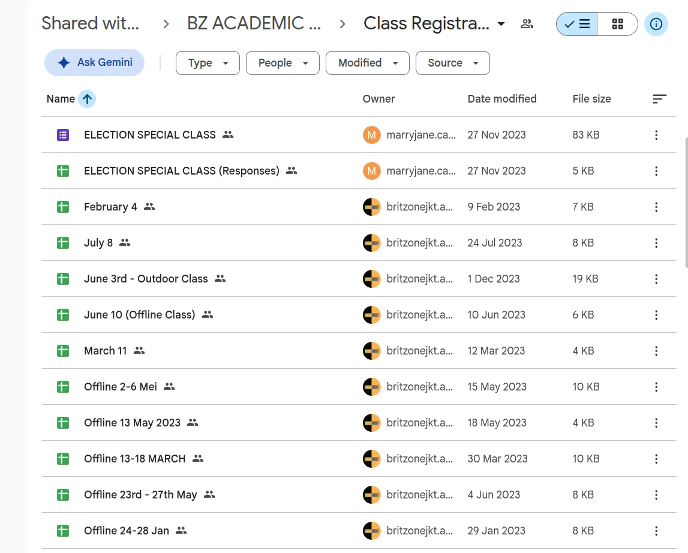
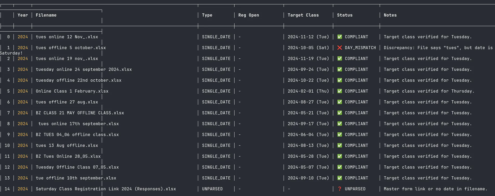
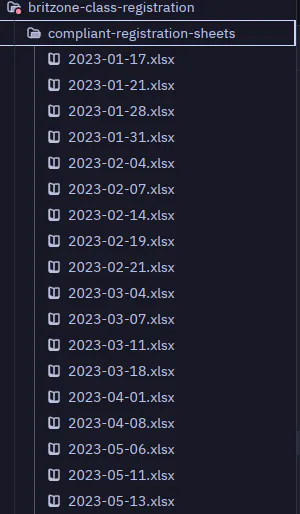
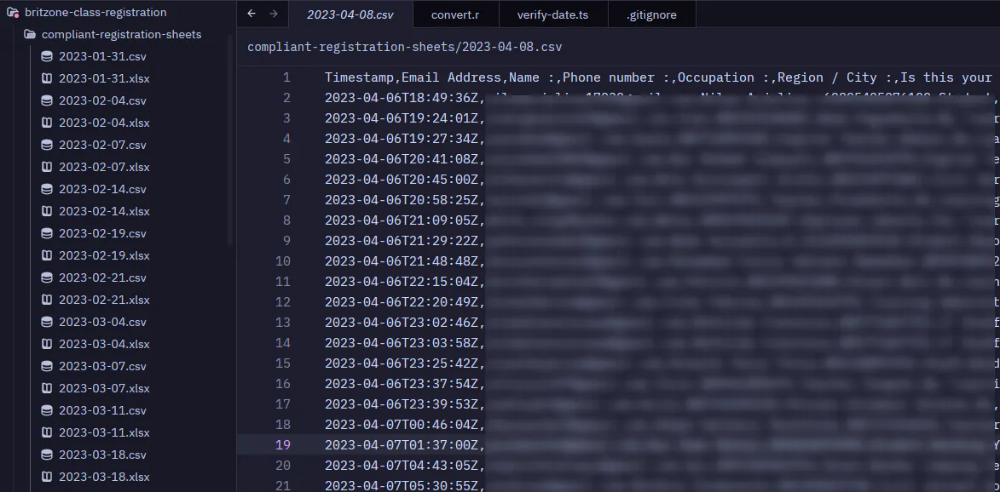
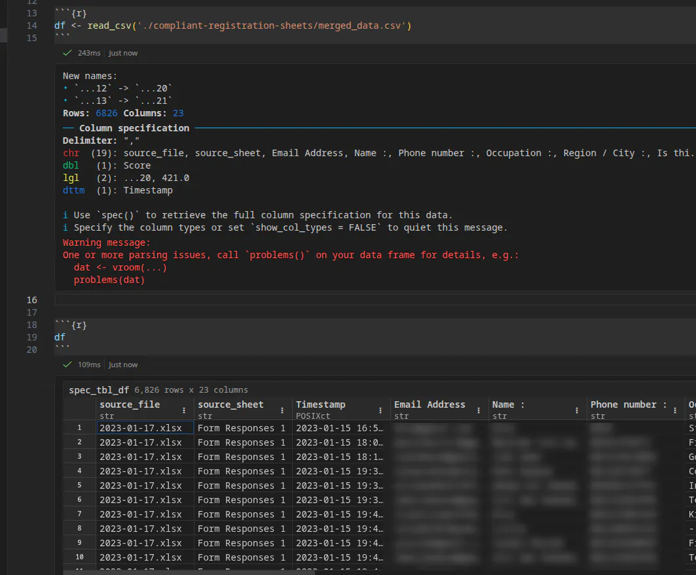

## Business Context

Britzone is one of the largest English Community in indonesia based that has been active since 2003. It conducts 3-5 sessions every week, where participants have to register through Google Forms to attend for every session. Unfortunately, these data are never properly managed, leaving them to pile up over time.

Starting in 2026, efforts have been made to standardize the system, including overhauling the division structure, creating a new IT team, creating standards for class registration, unifying forms, etc.

## My Role

As the leader of the IT team, I volunteered to help clean up the past data that have been piling up in Google Drive. The plan is to cleanly aggregate every session's data into a single, standardized format that can be easily analyzed for various purposes, including demographic analysis. 

## Discovered Issues

### Scattered Files & Inconsistent Naming

The Google Drive is organized by year.


Before 2025, each session is stored in a different sheet, with inconsistent naming convention, making it difficult to merge the data for analysis. 


### No response validation

The Google Sheets come from Google Form's response data. So the next thing to check is the Google Form itself. What I found is, there is no response validation at all. The question is only marked as required, and the participant can enter anything. 


User inputs are one of the main sources of data quality issues. Without proper validation, the data can be inaccurate or incomplete. 

### No reliable field to match participants across sessions

Every participant is required to register for every new session, entering the same data again (name, email, phone number). However, these are all self-report with no verification, the participant can practically fill out anything. 

## Cleaning Phase

## Filename Cleanup

First of all, we need to cleanup the filenames before we clean the files themselves. Also, data below 2023 will be postponed for now since none of us were there at the time. 

```
1.4 MiB  registration-sheets
868.0 KiB ├─  2023
584.0 KiB └─  2024

2 directories, 98 files
```

2024 data, while stil scattered, is in a reasonably better shape because the dates on the file names reflected the actual date of the event.


Whereas in 2025, they sometimes use range instead. I suspect it's the time range of when the form is opened and closed. 



So I wrote a script using chrono and dayjs to verify those dates, and yes they're indeed as I suspected. 



Though, not all. Some don't have any dates at all in the filename, some have discrepancy between with the actual date of the event.

We can handle that later, for now I moved all the compliant sheets into a separate folder and rename them into ISO date format.



## File merging

Now that the filenames are cleaned up, we can merge the files into a single CSV file. But before that, we need to verify whether the columns actually matched.

For that, I quickly converted all those files to CSV using R and just compare them with eyes. Yeah it's not ideal, but good enough for quick check, as the full discrepancy will be known anyway by the time we merge them together.



Now let's merge them together.



As expected, there's lot of things need to be fixed, but for now, at least the overall shape is in place. Now we can do aggregate analysis on this if needed. 