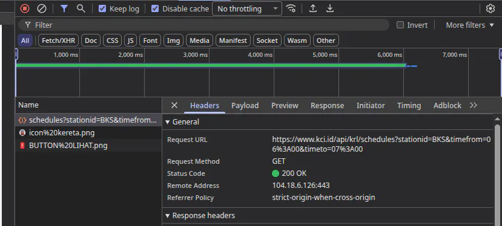
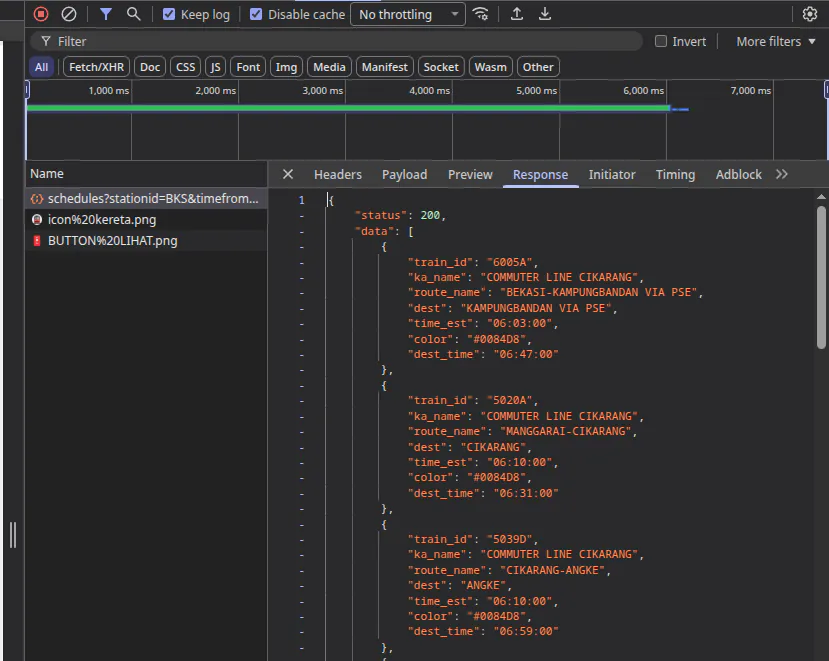
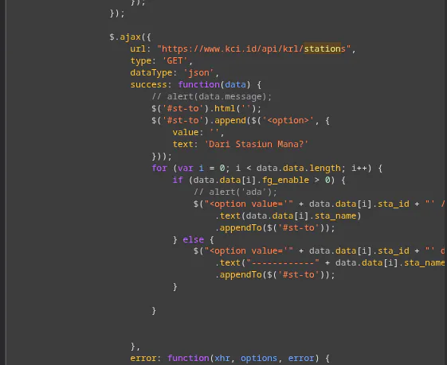

## What is the project about

This project scrapes the endpoints of Kereta Commuter Indonesia (KCI) API to extract the full schedules and timetables of all operating KRL stations in Jabodebate, Indonesia.

## Output

The output of this project is a GTFS (General Transit Feed Specification) dataset that can be imported to any GTFS parser and visualizer, allowing easy inspection of any KRL station's schedule and any destination route.

## Why the project was created

I'm a frequent passenger of Indonesian KRL Railways. One of the most common things to do is looking up schedules for the station near you.

Unfortunately, both the official website and mobile app of Commuter Line, namely C-Access, is severely lacking in features, user experince, and performance.

This project aims to scrape the full timetables of KRL and build a data pipeline that will export to GTFS that can be imported to any GTFS visualizer.

## Discovering Data Source

By querying any station's schedule on the website and inspecting the network request, you can see the exact API endpoint KCI is using devtools

The payload seems straightforward. It accepts station code and date range, and the response is a JSON object with the schedule data.

If you look at the HTML source code, you can see it also has special endpoint for getting all available stations.

Combining those informations, I created a program to fetch every single train station schedule.

## Scraping Strategy

### 1. Balancing Speed and Politeness

I don't want to put too much load on the KCI server as it would risk getting me banned at best, or even worse, causing them to raise the security significantly. But at the same time, I don't want the process to be too slow either as there is a total of 94 stations in Jabodetabek, and over 1000+ distinct trip id.

So I limit the concurrency to 3 requests at a time, but each requset can only be made after at least 1 second has passed since the last request (pacing). 

Also, the API response time is aroudn 5-10 so that signifanctly reduce my request rate anyway. 

## 2. Scraping flow

1. query the list of stations from /stations endpoint (1 request)
2. fetch the schedule for each station. (94 total requests)
3. fetch the trip details for each trip id (1000+ total requests)

### 3. Using Git as natural drift detection

Since the API response is a JSON object, I store it as-is in a file for each station. Each snapshot will be stored in its own folder, allowing easy comparison between different snapshots using git. 

## Dificulty during scraping

Of course, it wasn't completely smooth. There's some obstacles I've encountered along the way.

### 1. Unexpected TLS verification by Cloudflare

Apparently, I initially got blocked by Cloudflare. This is strange since direct request seems to be fine? 

Then I found out it was due to the user-agent claiming to be Chrome web browser when it's actually a fetch from Bun. And Cloudflare attempted testing TLS fingerprinting to verify the browser.

So I just simply replace the entire user-agent string with just 'Mozilla/5.0' and it worked.

### 2. Slow API response

The endpoint returns 5-10 seconds for each request, which is painfull slow and make it difficult in case I need to re-fetch to test for data drift. This is what pushed the git architecture initially. That way, I don't need to worry about losing past data since everything is committed.

## Result

The result is an independent data pipeline that can fetch the entire KCI data, process it into an SQLite databaes, and export it as GTFS zip file; all within CLI commands. 