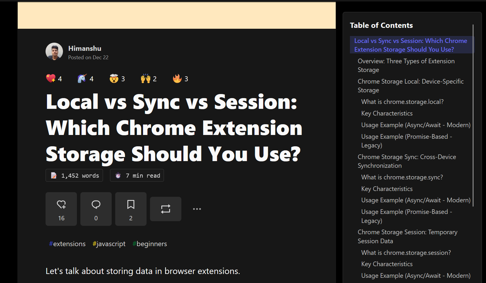
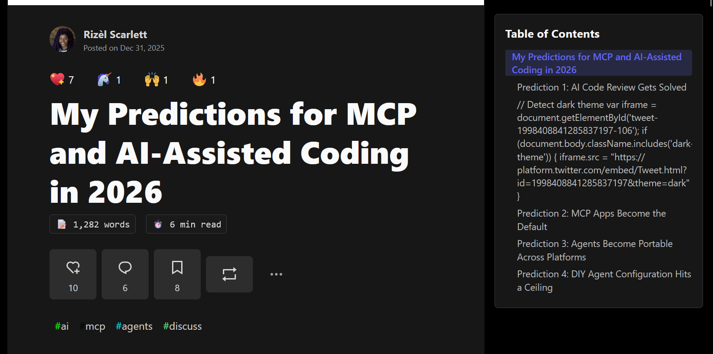
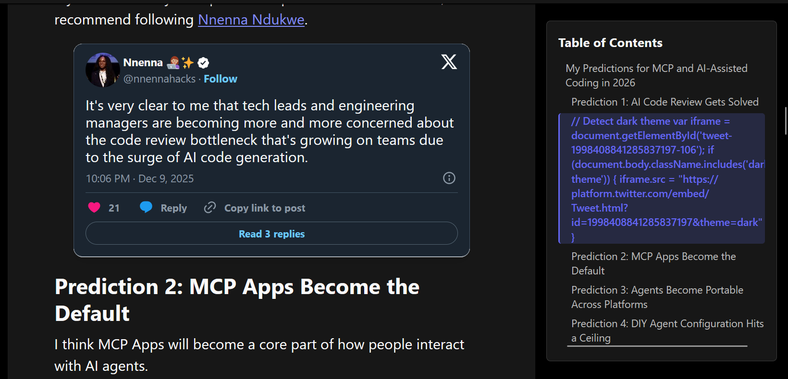
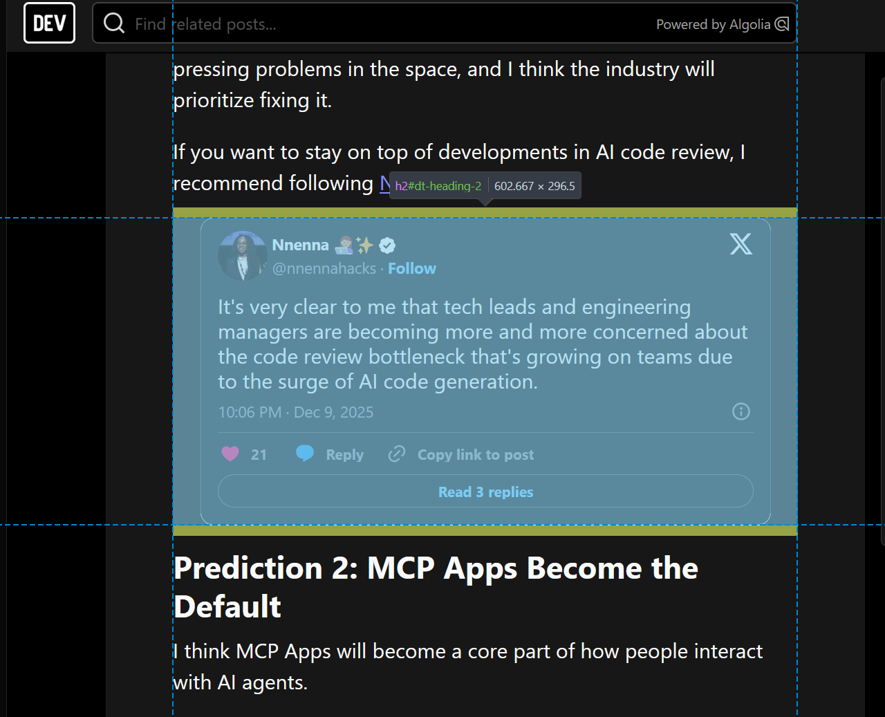
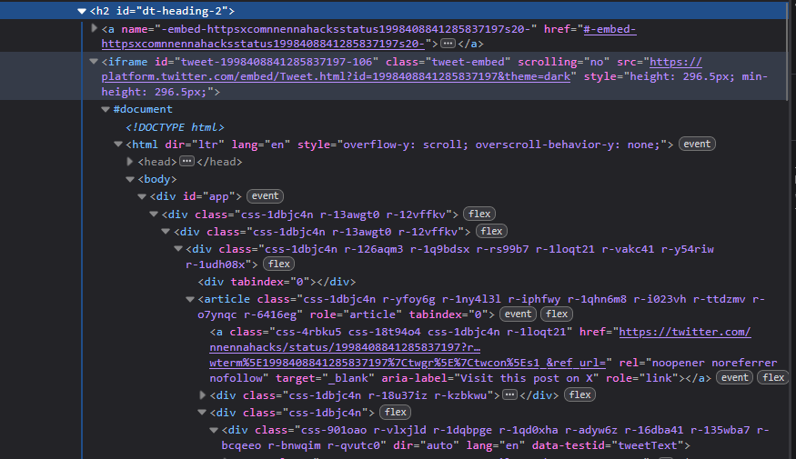

I was testing an extension I've recently built for dev.to. One important feature of the extension is adding table of content (ToC) to articles, so that you can easily navigate long articles and see the structure of the article at a glance.

The idea is simple. I just map every heading on the article as an item on the ToC. For example, here is what you'll see if you open this [article\]\([https://dev.to/notearthian/local-vs-sync-vs-session-which-chrome-extension-storage-should-you-use-5ec8](<https://dev.to/notearthian/local-vs-sync-vs-session-which-chrome-extension-storage-should-you-use-5ec8#dt-heading-1>))

Fortunately, dev.to cleanly renders the headings you wrote as an apprpriate heading with the correct level. So I can easily map the heading content and hierarchy.

At least that's what I thought until I saw this weird thing on this article.

*what the heck is that?* I thought. I immediately click on it to see what it is. And it turned out to be an embed.

I can vaguely guess what happens, and I opened up my DevTool right away.

Yep. The entire embed is wrapped in an h2. At first, I thought it was a bug from dev.to. But the embeds from other posts were fine. So maybe it's a mistake from the author. Maybe he wrote `##` at the wrong place.

Just to be clear, the focus of the article is not about finding whose fault is this. Everyone makes mistake. It's a small typo that we all do occasionally anyway.

However, this highlight what does it mean to be a an extension developer. It's an entirely different world as compared to developing websites, where you completely own the codebase.

When developing an extension, you have to reverse engineer the website. You have to understand how each of the component work, which content the HTML represents, how it came to be, how it changes depending on what you do, and so on.

This bug I discovered was the result of a hindsight I've made. I didn't fully think through how the HTML came to be, how content was made. I only looked at the HTML, see structured headings, and thought "ohh nice, I can map these ##  into a ToC title".

I forgot that these HTML was generated from the author's writing. The author is the one that wrote the original markdown, and they can write it however they want. In a way, you can say the HTML is user-generated.

Of course. These things may seem obvious, but it's easy to forget. Sometimes, I'm too immersed in developing the features, and forget the number 1 priority when building an extension: *understand how the website works.*

Do you have similar experience? Comment down below!
